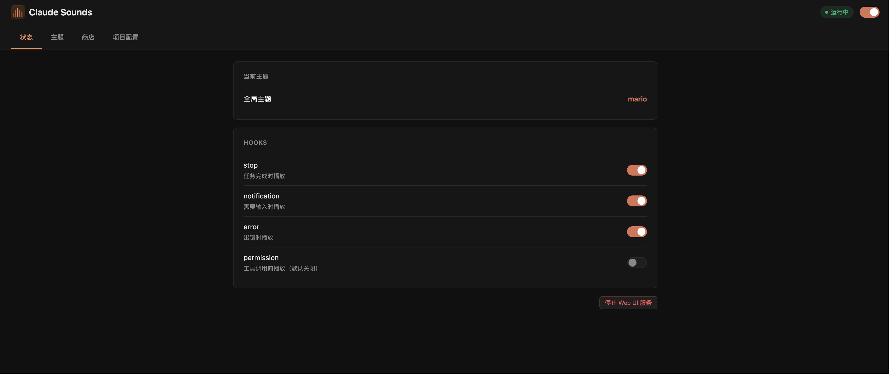
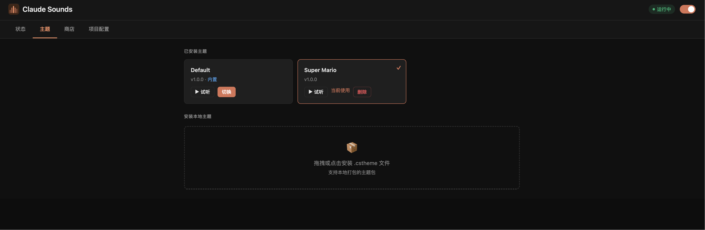
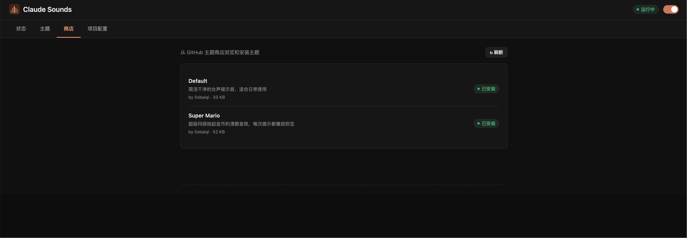

# Claude Sounds Plugin

Play audio on Claude Code events — task done, input needed, tool calls, errors. Supports themes, per-project config, and a built-in graphical Web UI.

让 Claude Code 在关键事件时播放提示音，支持主题切换、项目级配置和图形化管理界面。

## Screenshots / 界面预览







## Features / 功能

- Plays sounds on Stop, Notification, Error, Permission, and PermissionRequest events
- Graphical Web UI for visual management (no command line required)
- Theme support — built-in default theme, install more from the store
- Per-project theme and hook overrides
- Cross-platform: macOS / Linux / Windows
- Zero external dependencies (pure Shell + Python 3 stdlib)

## Supported Events / 支持的事件

| Event | Trigger | Default |
|-------|---------|---------|
| Stop | Task completed | ✅ On |
| Notification | Input needed | ✅ On |
| Error | Error occurred | ✅ On |
| Permission | Before every tool call | ❌ Off |
| PermissionRequest | When permission dialog appears (v2.0.45+) | ✅ On |

## Installation / 安装

```bash
git clone https://github.com/0xbaiqi/claude-sounds-plugin
cd claude-sounds-plugin
bash install.sh
```

Restart Claude Code to activate. / 重启 Claude Code 生效。

## Usage / 使用

### Graphical UI (recommended) / 图形界面（推荐）

```
/sounds:cs ui
```

Opens a browser-based dashboard to:  
在浏览器中可视化管理：

- Toggle the plugin and individual hooks / 开关插件和各个 Hook
- Browse, preview, and switch themes / 浏览、试听、切换主题
- Install themes from the store / 从商店安装主题
- Install local `.cstheme` files / 安装本地 `.cstheme` 文件
- Configure per-project theme and hooks / 按项目配置主题和 Hook

### Command Line / 命令行

```
/sounds:cs               Show current config / 查看当前配置
/sounds:cs help          Full command reference / 查看完整帮助
```

#### Basic control / 基本控制

```
/sounds:cs enable        Enable plugin / 启用插件
/sounds:cs disable       Disable plugin / 禁用插件
```

#### Hook management / Hook 管理

```
/sounds:cs hook status                  Show hook states / 查看状态
/sounds:cs hook enable  permission          Enable tool-call sound / 开启工具调用提示音
/sounds:cs hook enable  permission_request  Enable dialog-appear sound / 开启权限弹框提示音
/sounds:cs hook disable stop            Disable stop sound / 关闭任务完成提示音
```

#### Theme store / 主题商店

```
/sounds:cs theme store list              List available themes / 查看可用主题
/sounds:cs theme store install mario     Install a theme / 安装主题
/sounds:cs theme store update            Update all themes / 更新所有主题
```

#### Local themes / 本地主题

```
/sounds:cs theme list                    List installed themes / 查看已安装主题
/sounds:cs theme <name>                  Switch theme / 切换主题
/sounds:cs theme pack ./mytheme          Pack a custom theme / 打包自制主题
/sounds:cs theme install ./my.cstheme   Install local package / 安装本地主题包
/sounds:cs theme remove  <name>          Remove theme / 删除主题
/sounds:cs theme cache-clear             Clear audio cache / 清除缓存
```

#### Per-project config / 项目级配置

Run from your project root; only affects that project.  
在项目根目录运行，只影响当前项目：

```
/sounds:cs project theme mario           Set project theme / 设置项目主题
/sounds:cs project hook disable stop     Disable stop in this project / 项目内关闭 stop
/sounds:cs project hook status           Show project hook config / 查看项目 hook 配置
/sounds:cs project status                Show full project config / 查看完整项目配置
/sounds:cs project clear                 Reset to global config / 清除项目配置
```

#### Test sounds / 测试声音

```
/sounds:cs test          Play all sounds in sequence / 依次播放所有声音
/sounds:cs test stop     Test a single sound / 只测试 stop
```

## Creating a Theme / 制作主题

Theme packages are `.cstheme` files (custom binary format with SHA-256 integrity check).

1. Create a folder with 5 MP3s + `manifest.json`:

```
mytheme/
  stop.mp3               task completed
  notification.mp3       input needed
  error.mp3              error occurred
  permission.mp3         before tool call
  permission_request.mp3 when permission dialog appears
  manifest.json          {"name":"mytheme","display_name":"My Theme","version":"1.0.0"}
```

All sounds can reference the same MP3 file. / 所有文件可以是同一份音频的副本。

2. Pack and install:

```
/sounds:cs theme pack ./mytheme
/sounds:cs theme install ./mytheme.cstheme
/sounds:cs theme mytheme
```

Share your theme by submitting a PR to [claude-sounds-themes](https://github.com/0xbaiqi/claude-sounds-themes).

## User Data / 用户数据

All config and themes are stored under `~/.claude/claude-sounds-xapipro/`:

```
config.json     Global settings (theme, enabled, hooks, project registry)
themes/         User-installed themes
cache/          Auto-extracted audio cache (safe to delete)
```

Per-project config is stored in `<project-root>/.claude/sounds.json`.

## Uninstall / 卸载

```bash
bash uninstall.sh
```

## License / 协议

MIT
